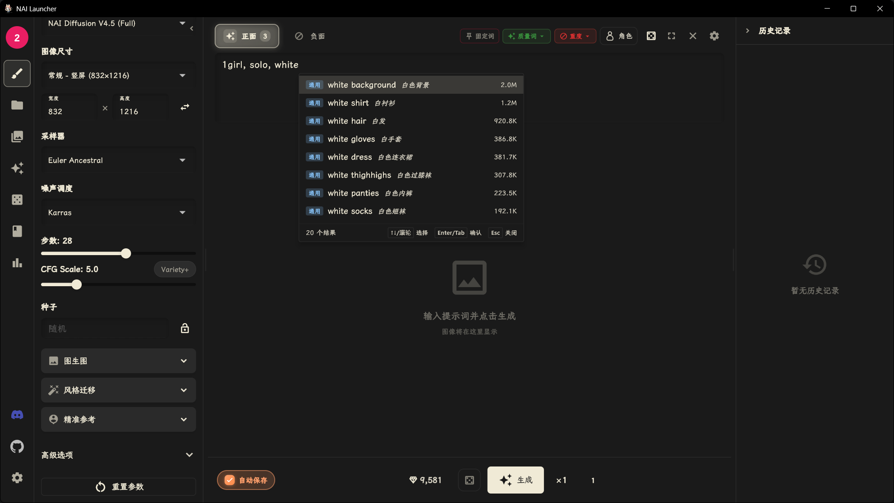
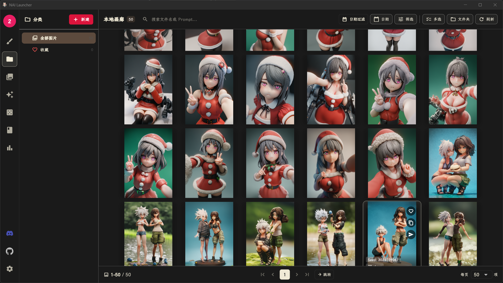
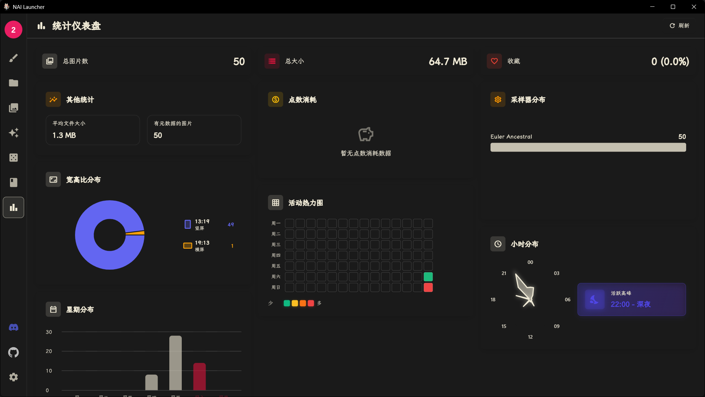

# NAI Launcher

<p align="center">
  
</p>

<p align="center">
  <strong>NovelAI 跨平台第三方客户端</strong>
</p>

<p align="center">
  <a href="#-功能特性">功能特性</a> •
  <a href="#-安装说明">安装说明</a> •
  <a href="#-使用方法">使用方法</a> •
  <a href="#-技术栈">技术栈</a> •
  <a href="#-项目结构">项目结构</a> •
  <a href="#-开发指南">开发指南</a>
</p>

<p align="center">
  
  
  
  <a href="https://discord.gg/R48n6GwXzD"></a>
</p>

---

## 📋 目录

- [项目简介](#-项目简介)
- [功能特性](#-功能特性)
- [安装说明](#-安装说明)
  - [系统要求](#系统要求)
  - [下载安装](#下载安装)
  - [从源码构建](#从源码构建)
- [使用方法](#-使用方法)
  - [首次启动](#首次启动)
  - [图像生成](#图像生成)
  - [画廊管理](#画廊管理)
- [技术栈](#-技术栈)
- [项目结构](#-项目结构)
- [开发指南](#-开发指南)
  - [环境配置](#环境配置)
  - [构建运行](#构建运行)
  - [代码规范](#代码规范)
- [许可证](#-许可证)

---

## 🚀 项目简介

**NAI Launcher** 是一个专为 [NovelAI](https://novelai.net/) 设计的第三方客户端，使用 **Flutter** 构建，支持 **Windows** 平台（Android 版本正在计划中）。

本项目旨在为 NovelAI 用户提供更加便捷、高效的图像生成体验，同时提供强大的本地画廊管理功能。无论是日常抽卡、批量生成，还是图库整理、数据分析，NAI Launcher 都能满足你的需求。

### 主要优势

- 🎨 **优雅的界面设计** - 16套精致主题，每套支持深色/浅色双模式，毛玻璃效果
- 🖼️ **强大的图像生成** - 支持 NovelAI 全系列模型（V1-V4.5），文生图、图生图、Vibe Transfer、Precise Reference
- 📚 **智能画廊管理** - SQLite 全文搜索，PNG 元数据解析，三级缓存，批量操作支持撤销/重做
- 📊 **数据可视化** - GitHub 风格活动热力图，Anlas 消耗追踪，多维度统计分析
- 🎮 **效率工具** - 66个可自定义快捷键，生成队列批量管理，悬浮球快捷控制
- 🌐 **Danbooru 集成** - 三数据源支持，智能标签系统，Pool 标签提取
- 🔒 **隐私安全** - 本地加密存储，JWT 自动刷新，安全认证
- ⚡ **性能优化** - 虚拟列表、后台索引、并发控制、智能缓存

---

## ✨ 功能特性

### 核心功能

| 功能 | 描述 | 状态 |
|------|------|------|
| 🔐 安全登录 | 支持 NovelAI 账号密码登录，本地加密存储 | ✅ |
| 🎨 文生图 | 支持 Prompt 编辑、参数调整、多模型选择 | ✅ |
| 🖼️ 图生图 | 支持图片上传、强度调节、参考图生成 | ✅ |
| 🌈 Vibe Transfer | 风格迁移功能，保持图片风格一致性 | ✅ |
| 📂 画廊管理 | 本地图片库管理，支持标签、收藏、搜索 | ✅ |
| 🔍 智能搜索 | 基于 SQLite 的全文搜索和筛选 | ✅ |
| 💾 数据导出 | 支持 PNG 元数据导出、批量下载 | ✅ |
| 🌙 深色模式 | 16套预设主题，每套支持深色/浅色双模式 | ✅ |
| 📊 统计仪表盘 | 生成数据统计、活动热力图、Anlas消耗追踪 | ✅ |
| 🎮 快捷键系统 | 66个可自定义快捷键，提升操作效率 | ✅ |
| 📥 生成队列 | 批量生成任务管理，悬浮球快捷控制 | ✅ |
| 🌐 Danbooru集成 | 在线画廊浏览、标签搜索、Pool同步 | ✅ |

### 界面预览

<p align="center">
  
  <br>
  <em>图像生成主界面 - 支持完整参数调整和实时预览</em>
</p>

<p align="center">
  
  <br>
  <em>本地画廊 - 瀑布流浏览，支持3D卡片效果</em>
</p>

<p align="center">
  
  <br>
  <em>图片详情页 - 大图预览、元数据展示、参数复用</em>
</p>

<p align="center">
  
  <br>
  <em>Danbooru 在线画廊 - 浏览、搜索、标签提取</em>
</p>

<p align="center">
  
  <br>
  <em>统计仪表盘 - GitHub风格活动热力图、生成数据分析</em>
</p>

### 平台支持

| 平台 | 状态 | 说明 |
|------|------|------|
| Windows | ✅ 可用 | 完整的桌面体验，支持窗口管理、系统托盘 |
| Android | 🚧 计划中 | 移动端适配开发中，敬请期待 |

### 图像生成能力

- 🎨 **全系列模型支持** - NAI Diffusion V1/V2/V3/V4/V4.5、Furry 模型
- 🔧 **丰富的采样器** - 9种采样器（Euler、DPM++、DDIM等），智能版本映射
- 📐 **多分辨率预设** - 普通/大/壁纸/小尺寸，宽度高度自动对齐64像素
- 👥 **多角色生成**（V4模型）- 最多6个角色，独立位置坐标控制
- 🎭 **Vibe Transfer** - 支持16个参考图同时导入，强度标准化，预编码优化
- 🎯 **Precise Reference**（V4+）- 精准参考角色/风格，支持角色+风格混合模式
- 🖼️ **图生图** - 强度调节、局部重绘（Inpainting）、涂鸦编辑
- ✨ **图像增强** - 2x/4x超分、表情修正、背景移除、图片上色、线稿提取
- 🏷️ **标签反推** - WD14标签识别、Canny/Depth/OpenPose预处理

### Prompt 系统

- 💡 **智能自动补全** - Danbooru标签实时建议（最多20条），支持中文搜索
- 🌈 **NAI语法高亮** - 权重语法 `{tag:weight}` 视觉高亮
- 🔄 **SD语法自动转换** - 自动将 `(tag:weight)` 转换为 NAI 格式
- 📚 **词库系统** - 支持自定义标签库，别名解析 `\u003c词库名\u003e`
- 🔒 **固定词** - 前缀/后缀自动添加，支持启用/禁用
- ⚡ **UC预设** - 8种负向提示词预设（Heavy、Light、Human Focus等）

### 画廊管理

- 📁 **文件夹管理** - 自定义根路径，递归扫描，实时监控文件变化
- 🏷️ **分类系统** - 树形多级分类，拖拽分类，虚拟收藏分类
- 📦 **集合系统** - 创建多个图片集合，支持图片添加到多个集合
- 🔍 **全文搜索** - SQLite FTS5虚拟表，支持提示词内容全文检索
- 🎛️ **多维筛选** - 日期范围、收藏状态、标签、模型、采样器、分辨率
- 📊 **元数据管理** - PNG隐写解析（tEXt/zTXt + stealth_pngcomp），三级缓存
- 📤 **批量操作** - 删除、打包、编辑元数据、收藏，支持撤销/重做（50步）
- 🖼️ **快速预览** - 3D卡片效果，瀑布流布局，虚拟列表优化

### 生成队列

- 📋 **任务管理** - 最大50个任务，支持拖拽排序、批量置顶
- 🎮 **悬浮球控制** - 玻璃质感设计，脉冲/旋转动画，进度环显示
- ⏯️ **执行控制** - 开始/暂停/继续，自动执行模式，任务间隔设置
- 🔄 **失败处理** - 三种策略（自动重试/跳过/暂停等待），可配置重试次数
- 💾 **持久化存储** - Hive存储，应用重启自动恢复，运行中任务重置
- 📈 **实时统计** - 进度条、剩余时间估算、完成/失败/跳过计数
- 📤 **导入导出** - JSON/CSV/纯文本格式，支持分享

### Danbooru 集成

- 🌐 **多数据源** - Danbooru/Safebooru/Gelbooru 无缝切换
- 🔍 **智能搜索** - 通配符模糊匹配、多标签联合搜索、分类筛选
- 📚 **Pool浏览** - 系列/收藏类型，标签智能提取（权重计算）
- 🏷️ **标签系统** - 三层缓存架构（L1内存/L2 Hive/L3 API），中文支持
- 💾 **本地缓存** - 7天过期，最大1000张，HTTP/2多路复用
- 📥 **批量下载** - 并行下载，自定义保存路径，进度提示
- ⭐ **收藏同步** - Basic Auth认证，个人收藏夹浏览管理
- 📊 **排行榜** - 日/周/月排行浏览

### 快捷键系统

- ⌨️ **66个可自定义快捷键** - 覆盖所有主要操作
- 📑 **页面导航** - `Ctrl+1~7` 快速跳转各页面
- 🎨 **生成操作** - `Ctrl+Enter`生成，`Ctrl+Shift+Enter`加入队列
- 🖼️ **画廊浏览** - 方向键切换图片，`F`收藏，`Delete`删除
- 🎮 **全局控制** - `F1`帮助，`Ctrl+M`最小化到托盘，`Ctrl+Q`退出

---

## 📦 安装说明

### 系统要求

| 平台 | 最低要求 |
|------|----------|
| Windows | Windows 10 版本 1809+ (64位) |

### 下载安装

#### Windows

1. 前往 [Releases](https://github.com/Aaalice233/Aaalice_NAI_Launcher/releases) 页面
2. 下载最新版本的 `NAI-Launcher-Windows.zip`
3. 解压到任意目录
4. 运行 `nai_launcher.exe`

### 从源码构建

#### 环境要求

- [Flutter SDK](https://flutter.dev/docs/get-started/install) >= 3.16.0
- [Dart SDK](https://dart.dev/get-dart) >= 3.2.0

#### 构建步骤

```bash
# 克隆仓库
git clone https://github.com/Aaalice233/Aaalice_NAI_Launcher.git
cd Aaalice_NAI_Launcher

# 安装依赖
flutter pub get

# 生成代码（Freezed、Riverpod 等）
flutter pub run build_runner build --delete-conflicting-outputs

# 运行调试版本
flutter run

# 构建发布版本
# Windows
flutter build windows --release

```

---

## 🎯 使用方法

### 首次启动

1. 打开应用后，点击「登录」按钮
2. 输入你的 NovelAI 账号和密码
3. 选择是否启用代理（如需翻墙）
4. 完成登录后即可开始使用

### 图像生成

1. 在主界面输入 **Prompt**（提示词），支持 Danbooru 标签自动补全
2. 调整生成参数：
   - **模型选择**: V1/V2/V3/V4/V4.5、Furry 等
   - **图片尺寸**: 多种预设可选，支持自定义
   - **采样步数**: 1-50 步（默认 28）
   - **CFG Scale**: 提示词相关性 1.0-20.0（默认 5.0）
   - **采样器**: Euler Ancestral、DPM++、DDIM 等 9 种
   - **Vibe Transfer**: 添加风格/角色参考图（最多16个）
   - **Precise Reference**（V4+）: 精准参考角色或风格
3. 点击「生成」按钮或使用快捷键 `Ctrl + Enter`
4. 等待生成完成后保存或继续生成

### 画廊管理

1. 点击底部「画廊」标签或按 `Ctrl + 2`
2. 浏览本地保存的图片（瀑布流/网格视图）
3. 支持以下操作：
   - 🔍 **搜索**: 按标签、Prompt、文件名搜索（支持全文检索）
   - 🏷️ **标签**: 添加自定义标签，查看 PNG 元数据
   - ⭐ **收藏**: 标记喜欢的图片，快速筛选收藏
   - 🗑️ **删除**: 单张或批量删除
   - 📤 **导出**: 批量打包、元数据导出
   - 🔄 **复用参数**: 一键将图片参数应用到生成页面

### 生成队列（批量生成）

1. 配置好生成参数后，点击「添加到队列」或按 `Ctrl + Shift + Enter`
2. 悬浮球显示队列状态，点击打开队列管理页面
3. 在队列页面可以：
   - 拖拽调整任务顺序
   - 批量编辑、删除任务
   - 设置自动执行模式
   - 查看执行进度和统计

### Danbooru 在线画廊

1. 点击「在线画廊」标签或按 `Ctrl + 3`
2. 输入标签进行搜索（支持中文标签提示）
3. 浏览图片，点击可查看详情
4. 支持操作：
   - 📋 **复制标签**: 一键复制到剪贴板
   - 🎨 **发送到生成**: 自动填充提示词到生成页面
   - ➕ **加入队列**: 批量添加到生成队列
   - 💾 **下载**: 单张或批量下载原图

### 常用快捷键（桌面端）

| 快捷键 | 功能 |
|--------|------|
| `Ctrl + Enter` | 生成图片 |
| `Ctrl + Shift + Enter` | 添加到队列 |
| `Ctrl + S` | 保存当前图片 |
| `Ctrl + 1~7` | 切换页面（生成/本地画廊/在线画廊/随机配置/词库/统计/Vibe库） |
| `Ctrl + T` | 打开词库 |
| `Ctrl + R` | 随机提示词 |
| `Ctrl + M` | 最小化到托盘 |
| `Ctrl + J` | 切换队列显示 |
| `F1` | 打开快捷键帮助 |
| `Esc` | 关闭弹窗/返回 |

> 提示：按 `F1` 可在应用内查看完整的 66 个快捷键列表，所有快捷键均可自定义。

---

## 🛠️ 技术栈

### 核心框架

- **[Flutter](https://flutter.dev/)** - 跨平台 UI 框架
- **[Dart](https://dart.dev/)** - 编程语言

### 状态管理

- **[flutter_riverpod](https://riverpod.dev/)** - 响应式状态管理
- **[Riverpod Generator](https://riverpod.dev/docs/concepts/about_code_generation)** - 代码生成

### 网络请求

- **[Dio](https://github.com/cfug/dio)** - 强大的 HTTP 客户端
- **[dio_http2_adapter](https://github.com/cfug/dio/tree/main/plugins/http2_adapter)** - HTTP/2 支持

### 本地存储

- **[Hive](https://hivedb.dev/)** - 高性能键值存储
- **[sqflite_common_ffi](https://github.com/tekartik/sqflite/tree/master/sqflite_common_ffi)** - SQLite 数据库（桌面端）
- **[sqlite3_flutter_libs](https://github.com/simolus3/sqlite3.dart/tree/main/sqlite3_flutter_libs)** - SQLite 原生库
- **[flutter_secure_storage](https://github.com/mogol/flutter_secure_storage)** - 安全存储

### 图片处理

- **[image](https://pub.dev/packages/image)** - Dart 图片处理库
- **[cached_network_image](https://github.com/Baseflow/flutter_cached_network_image)** - 网络图片缓存

### 其他重要库

| 库 | 用途 |
|----|------|
| [go_router](https://pub.dev/packages/go_router) | 声明式路由 |
| [freezed](https://github.com/rrousselGit/freezed) | 不可变数据类 |
| [window_manager](https://github.com/leanflutter/window_manager) | 桌面窗口管理 |
| [tray_manager](https://github.com/leanflutter/tray_manager) | 系统托盘 |
| [super_drag_and_drop](https://github.com/superlistapp/super_native_extensions) | 拖拽功能 |
| [flex_color_scheme](https://github.com/rydmike/flex_color_scheme) | 主题配色 |
| [fl_chart](https://pub.dev/packages/fl_chart) | 图表绘制 |
| [flutter_staggered_grid_view](https://pub.dev/packages/flutter_staggered_grid_view) | 瀑布流布局 |
| [logger](https://github.com/SourceHorizon/logger) | 日志记录 |

---

## 📁 项目结构

```
nai_launcher/
├── android/                    # Android 平台配置
├── assets/                     # 静态资源
│   ├── data/                   # 数据文件
│   ├── databases/              # 预置数据库
│   ├── icons/                  # 应用图标
│   ├── images/                 # 图片资源
│   ├── sounds/                 # 音效文件
│   └── translations/           # 国际化文件
├── fonts/                      # 字体文件
├── lib/                        # 主代码目录
│   ├── core/                   # 核心模块
│   │   ├── cache/              # 缓存管理
│   │   ├── constants/          # 常量定义
│   │   ├── crypto/             # 加密相关
│   │   ├── database/           # 数据库管理
│   │   ├── enums/              # 枚举定义
│   │   ├── extensions/         # 扩展方法
│   │   ├── network/            # 网络层
│   │   ├── parsers/            # 数据解析
│   │   ├── services/           # 业务服务
│   │   ├── shortcuts/          # 快捷键管理
│   │   ├── storage/            # 存储管理
│   │   └── utils/              # 工具类
│   ├── data/                   # 数据层
│   │   ├── datasources/        # 数据源
│   │   ├── models/             # 数据模型
│   │   ├── repositories/       # 仓库实现
│   │   └── services/           # 数据服务
│   ├── l10n/                   # 国际化
│   ├── presentation/           # 展示层
│   │   ├── providers/          # Riverpod Providers
│   │   ├── screens/            # 页面
│   │   ├── themes/             # 主题配置
│   │   ├── utils/              # 展示层工具
│   │   ├── widgets/            # 组件
│   │   └── router/             # 路由配置
│   ├── utils/                  # 通用工具
│   ├── app.dart                # 应用根组件
│   └── main.dart               # 入口文件
├── scripts/                    # 构建脚本
├── test/                       # 测试代码
├── tool/                       # 工具脚本
├── tools/                      # 构建工具
├── windows/                    # Windows 平台配置
├── pubspec.yaml                # 依赖配置
└── README.md                   # 项目说明
```

### 架构模式

本项目采用 **Clean Architecture** 分层架构：

```
┌─────────────────────────────────────┐
│         Presentation Layer          │  ← UI、Providers、Screens
├─────────────────────────────────────┤
│           Domain Layer              │  ← Models、Repositories (抽象)
├─────────────────────────────────────┤
│            Data Layer               │  ← Repositories (实现)、Datasources
├─────────────────────────────────────┤
│            Core Layer               │  ← 通用工具、服务、常量
└─────────────────────────────────────┘
```

---

## 💻 开发指南

### 环境配置

1. **安装 Flutter**

   ```bash
   # 参考官方文档
   # https://flutter.dev/docs/get-started/install

   # 验证安装
   flutter doctor
   ```

2. **安装 IDE 插件**

   - **VS Code**: Flutter、Dart 插件
   - **Android Studio**: Flutter 插件

3. **克隆项目**

   ```bash
   git clone https://github.com/Aaalice233/Aaalice_NAI_Launcher.git
   cd Aaalice_NAI_Launcher
   ```

### 构建运行

```bash
# 获取依赖
flutter pub get

# 运行代码生成（必需）
flutter pub run build_runner build --delete-conflicting-outputs

# 开发模式运行
flutter run

# 运行测试
flutter test

# 代码分析
flutter analyze

# 格式化代码
dart format lib test
```

### 代码规范

- 遵循 [Effective Dart](https://dart.dev/guides/language/effective-dart) 规范
- 使用 `flutter_lints` 进行静态分析
- 提交前运行 `dart format` 和 `flutter analyze`

### 提交规范

```
<type>(<scope>): <subject>

<body>

<footer>
```

**Type 类型：**

- `feat`: 新功能
- `fix`: 修复 Bug
- `docs`: 文档更新
- `style`: 代码格式（不影响功能）
- `refactor`: 代码重构
- `test`: 测试相关
- `chore`: 构建/工具相关

**示例：**

```
feat(gallery): 添加图片批量导出功能

- 支持选择多张图片导出
- 导出时保留 PNG 元数据
- 添加进度提示

Closes #123
```

### 参与贡献

1. Fork 本仓库
2. 创建特性分支 (`git checkout -b feature/amazing-feature`)
3. 提交更改 (`git commit -m 'feat: add amazing feature'`)
4. 推送分支 (`git push origin feature/amazing-feature`)
5. 创建 Pull Request

---

## 📄 许可证

本项目基于 MIT 许可证开源。

```
MIT License

Copyright (c) 2026 NAI Launcher Contributors

Permission is hereby granted, free of charge, to any person obtaining a copy
of this software and associated documentation files (the "Software"), to deal
in the Software without restriction, including without limitation the rights
to use, copy, modify, merge, publish, distribute, sublicense, and/or sell
copies of the Software, and to permit persons to whom the Software is
furnished to do so, subject to the following conditions:

The above copyright notice and this permission notice shall be included in all
copies or substantial portions of the Software.

THE SOFTWARE IS PROVIDED "AS IS", WITHOUT WARRANTY OF ANY KIND, EXPRESS OR
IMPLIED, INCLUDING BUT NOT LIMITED TO THE WARRANTIES OF MERCHANTABILITY,
FITNESS FOR A PARTICULAR PURPOSE AND NONINFRINGEMENT. IN NO EVENT SHALL THE
AUTHORS OR COPYRIGHT HOLDERS BE LIABLE FOR ANY CLAIM, DAMAGES OR OTHER
LIABILITY, WHETHER IN AN ACTION OF CONTRACT, TORT OR OTHERWISE, ARISING FROM,
OUT OF OR IN CONNECTION WITH THE SOFTWARE OR THE USE OR OTHER DEALINGS IN THE
SOFTWARE.
```

---

## 🙏 致谢

- [NovelAI](https://novelai.net/) - 提供强大的 AI 图像生成服务
- [Flutter](https://flutter.dev/) - 优秀的跨平台框架
- [Riverpod](https://riverpod.dev/) - 出色的状态管理方案
- 所有贡献者和用户

---

<p align="center">
  Made with ❤️ by NAI Launcher Team
</p>
