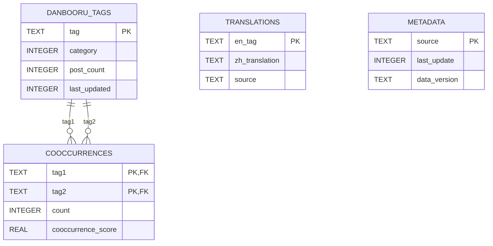

# 统一标签数据库 Schema v2 设计

## 1. 目标与约束

- 将翻译标签、Danbooru 标签、共现关系合并到一个 SQLite 数据库中，减少跨库查询与维护成本。
- 满足性能目标：
  - 单标签查询 `< 50ms`
  - 批量查询（10 个标签）`< 200ms`
- 保持写入可控：索引数量做“够用而非过度”设计，兼顾导入速度与查询性能。
- 兼容现有 `sqflite` 使用模式，不修改现有 Service API（仅提供 Schema 设计）。

---

## 2. 逻辑表与职责

统一数据库文件建议：`tag_data_v2.db`

包含 4 张主表：

1. `translations`：翻译映射（英文标签 -> 中文翻译）
2. `danbooru_tags`：Danbooru 标签主数据（类别、热度）
3. `cooccurrences`：标签共现关系（tag1 与 tag2 的共现强度）
4. `metadata`：每类数据源的版本和更新时间

---

## 3. ER 图（Mermaid）



说明：
- `cooccurrences.tag1/tag2` 外键关联 `danbooru_tags.tag`，保证关系边引用的是有效标签。
- `translations` 不强制外键到 `danbooru_tags`，避免翻译数据源与标签主数据不同步时的导入失败。

---

## 4. DDL 设计（CREATE TABLE / CREATE INDEX）

```sql
-- 建议初始化 PRAGMA（运行时配置）
PRAGMA foreign_keys = ON;
PRAGMA journal_mode = WAL;
PRAGMA synchronous = NORMAL;
PRAGMA temp_store = MEMORY;
PRAGMA busy_timeout = 5000;

-- 1) Danbooru 标签主表
CREATE TABLE IF NOT EXISTS danbooru_tags (
  tag TEXT NOT NULL COLLATE NOCASE,
  category INTEGER NOT NULL DEFAULT 0 CHECK (category >= 0),
  post_count INTEGER NOT NULL DEFAULT 0 CHECK (post_count >= 0),
  last_updated INTEGER NOT NULL,
  PRIMARY KEY (tag)
) WITHOUT ROWID;

-- 2) 翻译表
CREATE TABLE IF NOT EXISTS translations (
  en_tag TEXT NOT NULL COLLATE NOCASE,
  zh_translation TEXT NOT NULL,
  source TEXT NOT NULL,
  PRIMARY KEY (en_tag)
) WITHOUT ROWID;

-- 3) 共现关系表（双向存储：A->B 和 B->A）
CREATE TABLE IF NOT EXISTS cooccurrences (
  tag1 TEXT NOT NULL COLLATE NOCASE,
  tag2 TEXT NOT NULL COLLATE NOCASE,
  count INTEGER NOT NULL CHECK (count > 0),
  cooccurrence_score REAL NOT NULL DEFAULT 0.0 CHECK (cooccurrence_score >= 0),
  PRIMARY KEY (tag1, tag2),
  CHECK (tag1 <> tag2),
  FOREIGN KEY (tag1) REFERENCES danbooru_tags(tag)
    ON UPDATE CASCADE ON DELETE CASCADE,
  FOREIGN KEY (tag2) REFERENCES danbooru_tags(tag)
    ON UPDATE CASCADE ON DELETE CASCADE
) WITHOUT ROWID;

-- 4) 元数据表
CREATE TABLE IF NOT EXISTS metadata (
  source TEXT NOT NULL PRIMARY KEY
    CHECK (source IN ('translations', 'danbooru_tags', 'cooccurrences', 'unified')),
  last_update INTEGER NOT NULL,
  data_version TEXT NOT NULL
) WITHOUT ROWID;

-- ========== 索引 ==========

-- translations: 按来源筛选/增量维护
CREATE INDEX IF NOT EXISTS idx_translations_source
  ON translations(source);

-- danbooru_tags: 热门标签、分类热门、增量刷新
CREATE INDEX IF NOT EXISTS idx_danbooru_tags_post_count_desc
  ON danbooru_tags(post_count DESC);

CREATE INDEX IF NOT EXISTS idx_danbooru_tags_category_post_count_desc
  ON danbooru_tags(category, post_count DESC);

CREATE INDEX IF NOT EXISTS idx_danbooru_tags_last_updated_desc
  ON danbooru_tags(last_updated DESC);

-- cooccurrences: 核心查询路径（按 tag1 查相关标签并按 count 排序）
CREATE INDEX IF NOT EXISTS idx_cooccurrences_tag1_count_desc
  ON cooccurrences(tag1, count DESC, tag2);

-- cooccurrences: 预热高频关系 / 全局热门关系
CREATE INDEX IF NOT EXISTS idx_cooccurrences_count_desc
  ON cooccurrences(count DESC);
```

---

## 5. 索引策略与理由

| 表 | 索引 | 目标查询 | 理由 |
|---|---|---|---|
| `translations` | `PRIMARY KEY(en_tag)` | `WHERE en_tag = ?` | 单标签翻译查询主路径，O(logN) 定位 |
| `translations` | `idx_translations_source` | `WHERE source = ?` | 支持按来源分批更新/核对 |
| `danbooru_tags` | `PRIMARY KEY(tag)` | `WHERE tag = ?` | 单标签元信息查询主路径 |
| `danbooru_tags` | `idx_danbooru_tags_post_count_desc` | `ORDER BY post_count DESC LIMIT N` | 热门标签、预热候选快速获取 |
| `danbooru_tags` | `idx_danbooru_tags_category_post_count_desc` | `WHERE category=? ORDER BY post_count DESC` | 分类联想与热门筛选 |
| `danbooru_tags` | `idx_danbooru_tags_last_updated_desc` | 增量同步扫描 | 降低增量刷新开销 |
| `cooccurrences` | `PRIMARY KEY(tag1, tag2)` | `WHERE tag1=? AND tag2=?` | 去重与精确查边 |
| `cooccurrences` | `idx_cooccurrences_tag1_count_desc` | `WHERE tag1=? ORDER BY count DESC LIMIT N` | 最核心查询（单标签相关词） |
| `cooccurrences` | `idx_cooccurrences_count_desc` | 高频共现预热 | 冷启动热数据加载更快 |

### 为什么不再加更多索引

- `cooccurrences` 数据量最大（500 万+ 关系，双向写入后可达千万级记录），每新增一个索引都会显著拉高导入时间和磁盘占用。
- 当前索引集已经覆盖“按 tag 查 + 按 count 排序”的关键路径；其它次要查询（如按 `tag2` 反查）建议在真实瓶颈出现后再加。

---

## 6. 查询路径与性能映射

### 6.1 单标签查询（目标 < 50ms）

```sql
SELECT zh_translation
FROM translations
WHERE en_tag = ?;

SELECT category, post_count
FROM danbooru_tags
WHERE tag = ?;

SELECT tag2, count, cooccurrence_score
FROM cooccurrences
WHERE tag1 = ?
ORDER BY count DESC
LIMIT 20;
```

依赖索引：
- `translations` 主键
- `danbooru_tags` 主键
- `idx_cooccurrences_tag1_count_desc`

### 6.2 批量查询（10 标签，目标 < 200ms）

```sql
SELECT tag2, SUM(count) AS total_count
FROM cooccurrences
WHERE tag1 IN (?, ?, ?, ?, ?, ?, ?, ?, ?, ?)
  AND tag2 NOT IN (?, ?, ?, ?, ?, ?, ?, ?, ?, ?)
GROUP BY tag2
ORDER BY total_count DESC
LIMIT 50;
```

依赖索引：
- `idx_cooccurrences_tag1_count_desc`（先按 `tag1` 过滤，减少扫描范围）

---

## 7. 批量写入优化建议（事务 + prepared statement）

> 适用于 `sqflite` 导入流程，重点优化初次全量导入和大规模增量更新。

1. 使用单个大事务或分段事务（例如每 2,000~5,000 行一批）。
2. 使用 `batch` / prepared statement，避免逐条独立提交。
3. 导入期临时降低 durability（仅导入阶段）：
   - `PRAGMA synchronous = OFF`
   - `PRAGMA journal_mode = MEMORY`
4. 导入完成后恢复：
   - `PRAGMA synchronous = NORMAL`
   - `PRAGMA journal_mode = WAL`
5. 大批量导入时，建议顺序：
   - 建表（先不建二级索引）
   - 批量写入数据
   - 再创建二级索引（整体更快）

---

## 8. 存储空间预估（基于当前数据量）

已知基线（历史数据规模）：
- 翻译标签约 `50 MB`
- Danbooru 标签约 `100 MB`
- 共现关系约 `200 MB`

考虑 v2 额外因素：
- `cooccurrence_score` 新增列
- 新增二级索引（尤其 `cooccurrences`）
- SQLite 页管理与碎片开销

| 模块 | 基线数据 | 索引/附加列开销（估算） | 预估总量 |
|---|---:|---:|---:|
| `translations` | 50 MB | +5 MB ~ +10 MB | 55 MB ~ 60 MB |
| `danbooru_tags` | 100 MB | +25 MB ~ +35 MB | 125 MB ~ 135 MB |
| `cooccurrences` | 200 MB | +90 MB ~ +130 MB | 290 MB ~ 330 MB |
| `metadata` | < 1 MB | 可忽略 | < 1 MB |
| **合计** | **350 MB** | **+120 MB ~ +175 MB** | **约 470 MB ~ 525 MB** |

结论：统一库落地后，建议按 **500 MB 级别** 进行磁盘预算，并预留至少 **700 MB** 安全空间（导入临时文件 + VACUUM 峰值）。

---

## 9. 兼容性与实施建议

- 本文仅定义 Schema，不要求改动现有服务对外 API。
- 可先实现新 DB 初始化与导入脚本，再逐步将三个现有 service 的底层数据源切换到统一库。
- 推荐在导入后执行：
  - `ANALYZE;`（优化查询计划）
  - 周期性 `VACUUM;`（版本升级或大规模删除后）
